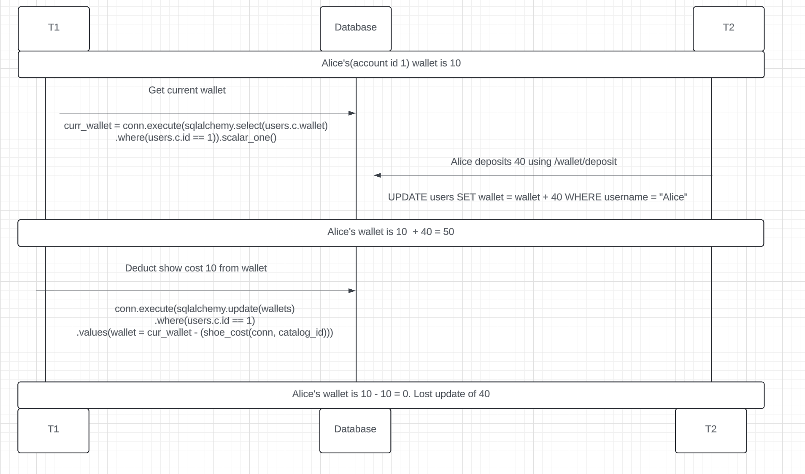
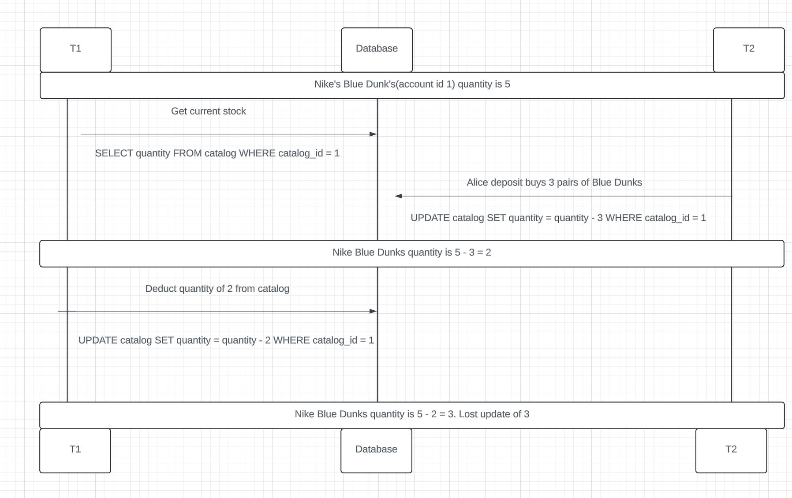

# Concurrency issues for ecommerce shoes

1. In /carts/checkout/, had we first got the price of the wallet and updated the wallet before running update then the code would have encountered a lost update anomaly.

Example issue


Updating wallet within a single update statement for each transaction.
```
            connection.execute(
                sqlalchemy.text("""
                    UPDATE users SET wallet = wallet - :price
                    WHERE id = :id
                """), 
                {
                    'id': user_info.id,
                    'price': shoe_info.price
                })

            connection.execute(
                sqlalchemy.text("""
                    UPDATE users SET wallet = wallet + :price
                    WHERE id = :id
                """), {
                    'id': shoe_info.user_id,
                    'price': shoe_info.price
                })
```

2. In /carts/checkout/, had we first got the qunatity of the item inside the catalog and updated the quantity before running update then the code would have encountered a lost update anomaly.

Example issue


SELECTING and UPDATING catalog quantity in two different calls
```
     stock = connection.execute(
                sqlalchemy.text("""
                    F
                """),
                {'catalog_id': item.catalog_id}
            ).scalar()

            if stock < item.quantity:
                raise HTTPException(status_code=400, detail="Not enough stock for item {}".format(item.catalog_id))

            shoe_info = connection.execute(
                sqlalchemy.text("""
                    UPDATE catalog SET quantity = quantity - :quantity
                    WHERE id = :id
                    RETURNING id, user_id, price
                """), 
                {'id': item.catalog_id, 'quantity': item.quantity}
            ).fetchone()
```
